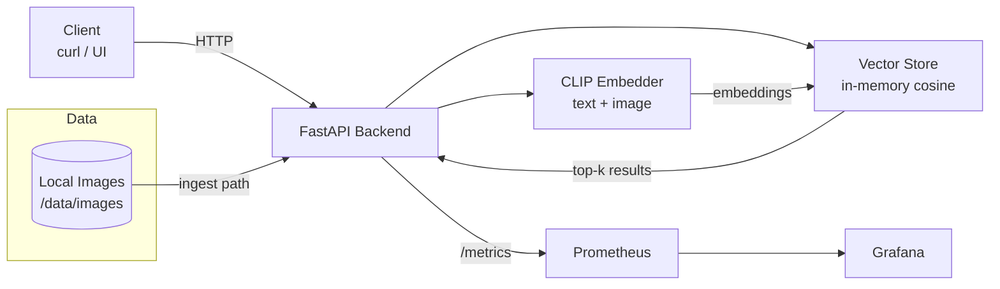
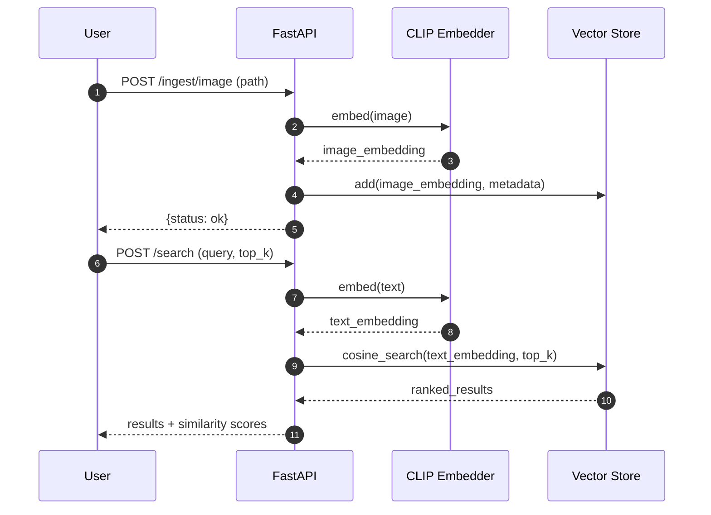

# VisionQuery

**VisionQuery** is a lightweight **text-to-image semantic search** system that serves a pretrained multimodal model behind an API, indexes image embeddings, and returns ranked results via cosine similarity.

It’s a backend-first MVP focused on **clarity and explainability**: simple vector storage, clean endpoints, containerized dev, and basic observability.

---

## What it does

- **Ingest images** into an embedding index
- **Embed text + images** into the same CLIP vector space
- **Search by natural language** and retrieve the most similar images
- **Expose metrics** for monitoring (Prometheus-compatible)

---

## Architecture

### High-level system



### Request flow



---

## Tech stack

- **API:** FastAPI
- **Embeddings:** pretrained CLIP (text + image)
- **Search:** in-memory vector store (cosine similarity)
- **Observability:** Prometheus + Grafana
- **Infra:** Docker + Docker Compose

---

## Repository layout

> This is the *meaningful* layout (excluding `node_modules/`, build artifacts, etc.).

```text
VisionQuery/
├── backend/
│   ├── app/
│   │   ├── main.py          # API routes + orchestration + metrics
│   │   ├── embeddings.py    # CLIP embedding (text + image)
│   │   └── vector_store.py  # in-memory similarity search
│   ├── Dockerfile
│   └── requirements.txt
├── frontend/                # optional React UI
├── data/
│   └── images/              # local images (not tracked)
├── monitoring/
│   └── prometheus/
│       └── prometheus.yml   # Prometheus scrape config
├── docker-compose.yml
└── README.md
```

---

## API

### Health
`GET /health`

Returns a simple status payload for Docker + monitoring checks.

### Ingest image
`POST /ingest/image`

Body:

```json
{ "path": "data/images/example.jpg" }
```

Embeds the image and stores its vector + metadata in the in-memory index.

### Search
`POST /search`

Body:

```json
{ "query": "a red car on the street", "top_k": 5 }
```

Returns the top-k most similar images with cosine similarity scores.

### Metrics
`GET /metrics`

Prometheus-compatible metrics (request counts, latency).

---

## Quickstart (Docker)

### Prerequisites

- Docker
- Docker Compose

### Run everything

From the repo root:

```bash
docker compose up --build
```

### Services

- **Backend API:** http://localhost:8000
- **Frontend UI:** http://localhost:5173
- **Prometheus:** http://localhost:9090
- **Grafana:** http://localhost:3000 (default: admin / admin)

### Stop

```bash
docker compose down
```

### Reset (including volumes)

```bash
docker compose down -v
```

---

## Local development (without Docker)

> Docker is recommended for consistent infra. Use local runs for faster iteration.

### Backend

```bash
cd backend
python -m venv .venv
source .venv/bin/activate
pip install -r requirements.txt
uvicorn app.main:app --reload --host 0.0.0.0 --port 8000
```

### Frontend (optional)

```bash
cd frontend
npm install
npm run dev
```

---

## Usage examples

### Ingest an image

```bash
curl -X POST http://localhost:8000/ingest/image \
  -H "Content-Type: application/json" \
  -d '{"path":"data/images/example.jpg"}'
```

### Search

```bash
curl -X POST http://localhost:8000/search \
  -H "Content-Type: application/json" \
  -d '{"query":"a dog on a beach","top_k":5}'
```

---

## Notes and design choices

- **Lazy model loading**: the CLIP model loads on first request to keep container startup fast and health checks reliable.
- **In-memory index**: simple to understand and easy to swap later (FAISS / pgvector).
- **Backend-first**: the core deliverable is a clean API and system design; the UI is optional.

---

## Limitations (intentional)

- Index resets on restart (no persistent vector store)
- No authentication / access control
- No batching or async inference
- Not tuned for large-scale indexing

These tradeoffs keep the system small, explainable, and interview-friendly.

---

## Possible extensions

- Replace the in-memory store with **FAISS** or **pgvector**
- Persist metadata + vectors in a database
- Add image upload support (instead of file paths)
- Add tracing + richer dashboards
- Batch embedding + async job queue for higher throughput

---

## References

- CLIP (OpenAI): Learning Transferable Visual Models From Natural Language Supervision
- FastAPI documentation
- Prometheus instrumentation + exposition formats
- Grafana documentation
- Docker Compose documentation
