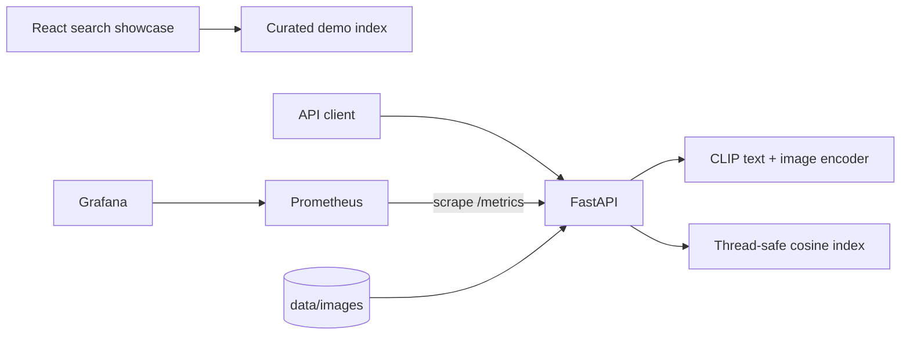
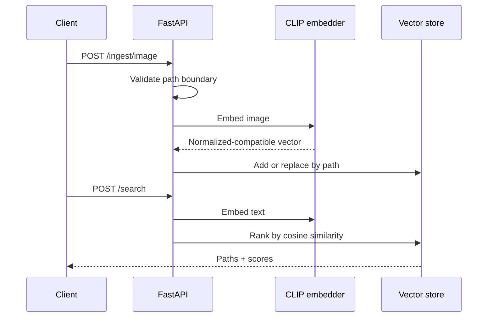

# VisionQuery

**VisionQuery** is a compact, explainable text-to-image retrieval project. It pairs a tested FastAPI/CLIP service for local inference with a fast, recruiter-friendly visual search showcase deployed on Vercel.

**Live website:** [vision-query.vercel.app](https://vision-query.vercel.app)


## Why it exists

File names are poor descriptions of visual ideas. VisionQuery demonstrates how a natural-language phrase can be mapped into the same vector space as an image, then ranked with cosine similarity. The project is deliberately small enough to review in one sitting while still covering model loading, validation, indexing, retrieval, observability, tests, containers, and a polished product surface.

## What works

- Index a JPEG, PNG, or other Pillow-supported image from the configured image directory.
- Generate image and text embeddings with `openai/clip-vit-base-patch32`.
- Re-index a path idempotently without creating duplicate records.
- Search the in-memory index and return ranked cosine-similarity scores.
- Reject malformed payloads, unsafe paths, invalid vectors, and dimension mismatches.
- Inspect health, model state, index size, request counts, and request latency.
- Explore a responsive hosted demo with natural-language search, category filters, ranked matches, empty states, and accessible image details.

## Hosted demo versus local model

The [Vercel website](https://vision-query.vercel.app) is a dependable, static showcase over a transparent 10-image concept index. It mirrors the query → rank → inspect product flow without pretending to execute a large ML model in a short-lived browser or serverless function.

The Docker/local API performs the actual CLIP inference described below. Its model is lazy-loaded on the first ingest or search request and cached for the lifetime of the backend process. The image index is intentionally in memory and resets when that process stops.

## Architecture


```mermaid
flowchart LR
  Browser[React search showcase] --> Catalog[Curated demo index]
  Client[API client] --> API[FastAPI]
  API --> CLIP[CLIP text + image encoder]
  API --> Index[Thread-safe cosine index]
  Prometheus -->|scrape /metrics| API
  Grafana --> Prometheus
  Images[(data/images)] --> API
```

### Local request flow


```mermaid
sequenceDiagram
  participant U as Client
  participant A as FastAPI
  participant E as CLIP embedder
  participant V as Vector store
  U->>A: POST /ingest/image
  A->>A: Validate path boundary
  A->>E: Embed image
  E-->>A: Normalized-compatible vector
  A->>V: Add or replace by path
  U->>A: POST /search
  A->>E: Embed text
  A->>V: Rank by cosine similarity
  V-->>U: Paths + scores
```

## Quick start

### One-command Docker demo

Requirements: Docker with Compose and enough disk space for PyTorch plus the CLIP model.

```bash
make demo
```

Then open:

- Website: <http://localhost:5173>
- API documentation: <http://localhost:8000/docs>
- Prometheus: <http://localhost:9090>
- Grafana: <http://localhost:3000> (`admin` / `admin` for local development)

Grafana starts with Prometheus already configured as its default data source.

### Index and search

Put an image at `data/images/example.jpg`, then run:

```bash
curl -X POST http://localhost:8000/ingest/image \
  -H "Content-Type: application/json" \
  -d '{"path":"data/images/example.jpg"}'

curl -X POST http://localhost:8000/search \
  -H "Content-Type: application/json" \
  -d '{"query":"a dog on a beach","top_k":5}'
```

The first model-backed request downloads and initializes CLIP, so it is slower than subsequent requests.

## API contract

| Method | Endpoint | Purpose |
| --- | --- | --- |
| `GET` | `/health` | Service, model-load, and index status |
| `GET` | `/metrics` | Prometheus exposition format |
| `POST` | `/ingest/image` | Validate, embed, and index one local image |
| `POST` | `/search` | Return the top 1–20 semantic matches |

The API only reads images inside `IMAGE_ROOT` (default: the repository's `data/images` directory). Production browser origins can be supplied as a comma-separated `CORS_ALLOWED_ORIGINS` value.

## Development and verification

Run every release gate with:

```bash
make check
```

This executes:

- Frontend lint, 5 search tests, production build, and runtime dependency audit.
- 11 backend API/vector tests without downloading the CLIP weights.
- Docker Compose configuration validation.

GitHub Actions runs the same frontend and backend gates on every push and pull request.

The committed [MANGO recruiter scorecard](docs/RECRUITER_SCORECARD.md) records the final quality, architecture, product-design, and deployment judgment.

## Repository map

```text
backend/
  app/                 FastAPI, lazy CLIP adapter, vector store
  tests/               API and retrieval unit tests
frontend/
  public/gallery/      Local demo image collection
  src/                 React experience and tested search logic
monitoring/
  prometheus/          Scrape configuration
  grafana/             Provisioned Prometheus data source
data/images/           Local images (ignored by Git)
docker-compose.yml     Full local stack
Makefile               Demo and quality workflows
```

## Design and engineering decisions

- **Lazy model loading:** health checks stay responsive before large model initialization.
- **Safe file boundary:** ingest requests cannot escape the configured image directory.
- **Idempotent paths:** re-ingesting an image replaces its vector instead of duplicating it.
- **In-memory index:** keeps the algorithm easy to inspect; FAISS or pgvector is the natural scale-up path.
- **Static production showcase:** gives recruiters an immediate, reliable product experience while keeping claims about CLIP execution precise.
- **No authentication:** appropriate for the local demonstration API; it should not be exposed as a public multi-tenant upload service.

## Limitations and next steps

- The local index is process-scoped and not designed for large collections.
- CPU inference is intentionally slower than GPU inference.
- The hosted concept index is a product demonstration, not a CLIP benchmark.
- A production service would add object storage, a persistent vector database, authentication, rate limits, queued ingestion, and model-serving infrastructure.

Demo photography is sourced from [Unsplash](https://unsplash.com/license) and stored locally for a stable review experience.

## License

MIT
